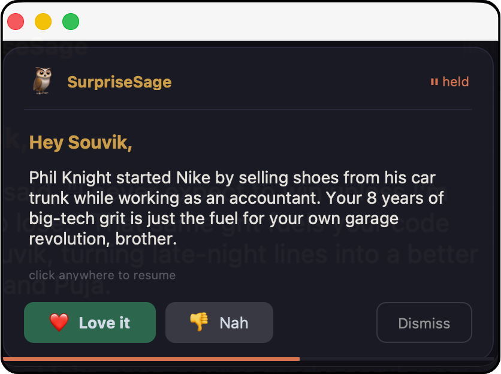

<p align="center">
  
</p>

<h1 align="center">SurpriseSage</h1>

<p align="center">
  <strong>Your Mac's gentle tap on the shoulder — with wisdom, warmth, and a wink.</strong>
</p>

<p align="center">
  <a href="#-quick-start">Quick Start</a>&nbsp;&nbsp;&bull;&nbsp;&nbsp;<a href="#-features">Features</a>&nbsp;&nbsp;&bull;&nbsp;&nbsp;<a href="#-how-it-works">How It Works</a>&nbsp;&nbsp;&bull;&nbsp;&nbsp;<a href="#-customization">Customization</a>&nbsp;&nbsp;&bull;&nbsp;&nbsp;<a href="#-contributing">Contributing</a>
</p>

<p align="center">
  
  &nbsp;
  
  &nbsp;
  
  &nbsp;
  
</p>

<br/>

<p align="center">
  
</p>

<p align="center">
  <sub>A surprise in action — personalized, contextual, and just the right amount of inspiring.</sub>
</p>

<br/>

---

SurpriseSage is a **local-first AI companion** that lives in your Mac's menu bar. It delivers context-aware micro-surprises throughout your day — philosophy, mythology, tech history, Stoic wisdom, sports grit, and more — all tailored to **your goals**, **your mood**, and **what you're doing right now**.

> Think of it as a wise, slightly cheeky older brother who knows you deeply and gently nudges you with exactly what you need.

<br/>

## &nbsp; Features

<table>
<tr>
<td width="50%">

**Personalized to you**
- Surprises tied to your real goals, interests, and context
- Learns from your thumbs up/down feedback

</td>
<td width="50%">

**Context-aware**
- Detects your active app (coding? browsing? relaxing?)
- Time-of-day personality shifts (energetic mornings, calm nights)

</td>
</tr>
<tr>
<td width="50%">

**Smart memory**
- ChromaDB + RAG ensures no surprise ever repeats
- Remembers what resonated and builds on it

</td>
<td width="50%">

**Beautiful & private**
- Dark popup with gold accents, fade-in animation, progress bar
- 100% local — your data never leaves your machine

</td>
</tr>
</table>

<br/>

<details>
<summary><strong>Full feature roadmap</strong></summary>

<br/>

| Feature | Status |
|:---|:---:|
| Local LLM via Ollama (Qwen 3.5 27B) | **Done** |
| ChromaDB memory with RAG | **Done** |
| macOS context detection (active app, window title, fullscreen) | **Done** |
| Dynamic prompt builder (time-aware, context-smart themes) | **Done** |
| CustomTkinter popup with fade-in/out, progress bar, click-to-hold | **Done** |
| System tray with theme picker, pause-with-timer, stats | **Done** |
| Feedback loop (thumbs up/down saves to memory) | **Done** |
| Scheduled surprises (fixed + Poisson random) | **Done** |
| DND hours, fullscreen skip | **Done** |
| Cloud fallback via LiteLLM | Ready |
| Knowledge fetcher (stocks, sports, news) | Planned |
| Chat mode | Planned |
| Cross-platform (Windows/Linux) | Future |

</details>

<br/>

---

<br/>

## &nbsp; Quick Start

### Prerequisites

| | Requirement | Notes |
|:---|:---|:---|
| **OS** | macOS | Apple Silicon recommended |
| **Runtime** | Python 3.11+ | Check with `python3 --version` |
| **AI** | [Ollama](https://ollama.com) | Local LLM runtime |
| **RAM** | 16 GB+ | 27B model uses ~22 GB &mdash; see [smaller models](#-using-a-smaller-model) |

### Installation

```bash
# Clone
git clone https://github.com/souvikghosh957/SurpriseSage.git
cd SurpriseSage

# Set up the AI models
ollama pull nomic-embed-text
ollama create surprisesage -f Modelfile

# Python environment
python3 -m venv .venv && source .venv/bin/activate
pip install -r requirements.txt

# Create your profile (interactive wizard)
python onboarding.py

# Install as a service & launch
./sagectl install
```

The owl appears in your menu bar. Click it and hit **"Next Surprise Now"** to get your first surprise!

SurpriseSage will **auto-start on login** and **restart on crash** — no terminal needed.

<details>
<summary><strong>macOS Accessibility permission</strong></summary>

<br/>

On first run, macOS will ask for Accessibility permission (needed to read window titles).

Grant it in: **System Settings > Privacy & Security > Accessibility**

</details>

<details>
<summary><strong>Run manually instead</strong></summary>

<br/>

If you prefer running in a terminal: `python surprisesage.py`

</details>

<br/>

### Managing the Service

Use `sagectl` to manage SurpriseSage:

| Command | What It Does |
|:---|:---|
| `./sagectl install` | Install as a login service and start now |
| `./sagectl uninstall` | Stop and remove from login items |
| `./sagectl start` | Start SurpriseSage |
| `./sagectl stop` | Stop SurpriseSage |
| `./sagectl restart` | Stop then start |
| `./sagectl status` | Check if it's running |
| `./sagectl logs` | Tail the live log |
| `./sagectl update` | Pull latest changes, reinstall deps, restart |

After making code changes locally, just run `./sagectl restart`. Pulling from remote? `./sagectl update` handles everything.

<br/>

---

<br/>

## &nbsp; How It Works

```
  Scheduler               Fixed times + random Poisson triggers
      │
      ▼
  Context Detector        What app are you using? Fullscreen?
      │
      ▼
  Memory (ChromaDB)       What have we talked about before?
      │
      ▼
  Prompt Builder          Goals + context + memories + theme + time-of-day
      │
      ▼
  AI Brain (Ollama)       Generates a personalized surprise
      │
      ▼
  Popup (CustomTkinter)   Shows it, collects your feedback
      │
      ▼
  Memory                  Saves surprise + feedback for next time
```

<br/>

---

<br/>

## &nbsp; Menu Bar

| Menu Item | What It Does |
|:---|:---|
| **Next Surprise Now** | Trigger a surprise immediately |
| **Surprise Me About...** | Pick a specific theme (philosophy, sports, etc.) |
| **Recent Surprises** | View and re-show past surprises |
| **Pause Surprises** | Toggle pause, or pause for 30m / 1hr / 3hr with auto-resume |
| **Stats** | Surprise count, feedback breakdown, memory stats |
| **Reload Profile** | Hot-reload your profile without restarting |
| **Quit** | Stop the app |

<br/>

---

<br/>

## &nbsp; Customization

Edit `user_profile.json` (created during onboarding) to tweak everything:

| Setting | Examples |
|:---|:---|
| **Goals** | What you're working toward |
| **Personal details** | Job, hobbies, family — makes surprises personal |
| **Themes** | `philosophy` `indian_mythology` `tech_innovation` `stoic_wisdom` `science_breakthroughs` `entrepreneurship` `sports_grit` |
| **Tone** | How the companion talks to you |
| **Schedule** | DND hours, fixed surprise times, frequency |
| **Memory** | Retention days, cleanup rules |

Changes take effect immediately via **Reload Profile** in the menu bar.

A sample is provided in [`sample_user_profile.json`](sample_user_profile.json).

<br/>

---

<br/>

## &nbsp; Using a Smaller Model

Running on less than 24 GB RAM? Edit the `Modelfile`:

```
FROM qwen3:8b
```

Then rebuild:

```bash
ollama create surprisesage -f Modelfile
```

<br/>

---

<br/>

## &nbsp; Project Structure

```
SurpriseSage/
├── surprisesage.py                  Main entry point
├── tray.py                          macOS system tray (rumps)
├── scheduler.py                     APScheduler triggers
├── prompt_builder.py                Dynamic prompt assembly + AI generation
├── memory.py                        ChromaDB RAG layer
├── context_detector.py              Active app & window detection
├── ui_popup.py                      Popup launcher (subprocess bridge)
├── _popup_window.py                 CustomTkinter popup window
├── config.py                        Constants, paths, defaults
├── onboarding.py                    First-run CLI wizard
├── sagectl                          Service manager (start/stop/update)
├── Modelfile                        Ollama custom model definition
├── sample_user_profile.json         Template profile
└── requirements.txt                 Python dependencies
```

<br/>

---

<br/>

## &nbsp; Privacy

| | |
|:---|:---|
| **100% local** | No data leaves your machine — ever (unless you opt into cloud fallback) |
| **Secure storage** | Memory stored in `~/.surprisesage/` with `chmod 700` permissions |
| **No tracking** | Zero telemetry, zero analytics, zero cloud calls by default |
| **Profile is gitignored** | Your `user_profile.json` stays local and private |

<br/>

---

<br/>

## &nbsp; Contributing

Contributions are welcome! Here's how:

1. **Fork** the repo
2. **Create a branch** &mdash; `git checkout -b my-feature`
3. **Make your changes** and test locally
4. **Open a Pull Request** against `main`

### Ideas for Contributions

- Windows / Linux support
- New surprise themes
- Knowledge fetchers (stocks, sports scores, news)
- Chat mode for interactive conversations
- Localization & multi-language support
- UI animation improvements

Found a bug or have an idea? [Open an issue](https://github.com/souvikghosh957/SurpriseSage/issues).

<br/>

---

<br/>

## &nbsp; License

[MIT](LICENSE) &mdash; use it, remix it, build on it.

<br/>

<p align="center">
  <sub>Built with curiosity and late-night coffee.</sub>
</p>
