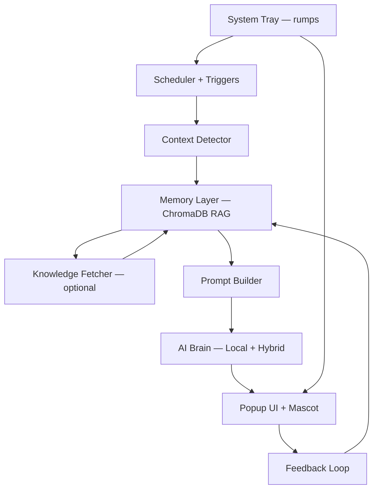

# SurpriseSage — Design Specification & Technical Architecture

**Version:** 1.2
**Date:** April 12, 2026
**Author:** Souvik Ghosh (solo builder, Bengaluru)
**Status:** Living Document — update as we ship

## 1. Vision & Product Overview

SurpriseSage is a **non-intrusive, personal AI life companion** that lives quietly in the background of your Mac (and later other platforms). It delivers delightful, context-aware micro-surprises exactly when you need them — never annoying, always personal.

It combines:
- Daily goal reminders tied to your real life
- Philosophical, Indian mythological, innovation history, tech breakthroughs, and Stoic wisdom
- Lightweight context awareness (what you're doing right now)
- Personal memory that grows with you over time (RAG)
- Optional real-world awareness (top news, cricket/football scores for your teams, your stock holdings)
- Cute cartoon mascot + clean, minimal popups

**Core Promise:** Feels like a wise, slightly cheeky older brother who knows you deeply and gently taps you on the shoulder with exactly what you need.

**Tagline:** "Your Mac's gentle tap on the shoulder — with wisdom, warmth, and a wink."

## 2. Goals & Non-Goals

### Must-Have Goals
- 100% local-first (works offline, zero servers by default)
- Highly customizable via simple `user_profile.json` (any user can make it *their* companion in minutes)
- Extremely lightweight and fast (popup generation < 1.2 seconds)
- Privacy-first and secure
- Non-intrusive (auto-dismiss, respects fullscreen/DND, minimal resource use)
- Self-improving via feedback loop + RAG memory
- Hybrid-ready (local model → cloud fallback with zero code changes)

### Nice-to-Have (v1+)
- Full chat mode
- Knowledge fetcher (news, sports, stocks)
- Animated mascot (Live2D / GIF)
- Cross-platform support (Mac → Windows/Linux via Tauri later)

### Non-Goals
- Heavy fine-tuning / LoRA (use RAG instead)
- Constant monitoring or screen recording
- Enterprise features initially
- Voice input/output (future phase)

## 3. High-Level Architecture



## 4. Detailed Components

### 4.1 User Profile & Customization (`user_profile.json`)
Single source of truth. Every user edits this once.

**Key sections:**
- `user_id`, `name`, `display_name`
- `goals[]` (array of strings)
- `personal_details` (family, hobbies, job, etc.)
- `preferences` (sports_teams, stocks, news_topics, favorite_themes)
- `tone`
- `schedule` (DND hours, frequency, fixed trigger times)
- `memory_settings` (detailed per-category retention, weights, cleanup rules, privacy)

### 4.2 Memory Layer (RAG)
- **Database:** ChromaDB (persistent, per-user folder: `surprisesage_memory_<user_id>`)
- **Embedding model:** `nomic-embed-text` (fast & local, served via Ollama — must be pulled separately)
- **Advanced features:**
    - Per-category retention days, weight, auto_keep
    - Automatic monthly cleanup
    - Recency boost
    - Sensitive keyword auto-redaction
- **Core functions:** `save_memory()`, `get_relevant_memories()`, `run_cleanup()`

### 4.3 Context Detector
- **macOS:** `pyobjc-framework-Cocoa` (`NSWorkspace` for active app, `CGWindowListCopyWindowInfo` for window titles)
- Detects: active app name, window title (truncated), fullscreen status
- Friendly labels: "watching a movie", "coding", "just opened Mac"
- Throttled + respects fullscreen/DND
- **Note:** Requires macOS Accessibility permission for window title access

### 4.4 AI Brain (Hybrid)
**Local (default):**
- Base model: `qwen3.5:27b` (17 GB on disk, ~20–22 GB RAM)
- Custom model: `surprisesage` (created via Modelfile)
- **System prompt in Modelfile contains ONLY personality, tone, and output format rules** (generic and reusable)
- All personal data (goals, context, memories) is **injected dynamically** at runtime
- Communicates via `ollama` Python client

**Cloud (optional toggle):**
- Library: `litellm`
- Supported: Claude Sonnet 4.6, GPT-4o, Gemini 2.5 Pro, Grok
- One-line model switch via `user_profile.json`

### 4.5 Prompt Builder
Dynamically assembles the full prompt by combining:
- Latest data from `user_profile.json`
- Current context
- Relevant memories from RAG
- Latest knowledge (if enabled)
- Random or forced theme

### 4.6 Scheduler & Triggers
- Library: APScheduler
- Fixed times (morning motivation, evening reflection)
- Random triggers (Poisson distribution, 2–6 hrs)
- Special events (Mac wake, app focus change)
- User-configurable Do-Not-Disturb hours + frequency slider
- Optional auto-start at login via macOS LaunchAgent

### 4.7 System Tray
- **Library:** `rumps` (Ridiculously Uncomplicated macOS Python Statusbar apps)
- Menu items: Pause/Resume, Next Surprise, Settings, Quit
- Status icon in macOS menu bar (always visible, lightweight)
- This is the primary way users interact with the app outside of popups

### 4.8 Popup UI + Mascot
- Framework: CustomTkinter (MVP) → PyQt6 (if needed for polish)
- Design: Semi-transparent rounded window, auto-dismiss (12 seconds)
- Mascot: PNG/GIF first → Live2D later
- Buttons: 👍 / 👎 / "Tell me more" / Dismiss
- Position: top-right corner of screen, above other windows

### 4.9 Knowledge Fetcher (v0.8+)
- Stocks: `yfinance`
- Sports (cricket/football): API-SPORTS or RSS
- News: `feedparser` + RSS feeds
- Cached in ChromaDB with category = "knowledge"
- Refresh interval configurable in `user_profile.json`

### 4.10 Feedback & Learning Loop
- Every popup stores feedback + category
- Used for retrieval weighting and automatic cleanup
- Thumbs-down suppresses similar content in future prompts

### 4.11 Logging & Error Handling
- Library: Python `logging` module
- Log levels: `DEBUG` (development), `INFO` (production default)
- Log file: `~/.surprisesage/surprisesage.log` (rotating, max 5 MB)
- Graceful degradation: if Ollama is down, queue the trigger and retry; if context detection fails, proceed without context
- Never crash the app — always catch, log, and continue

## 5. Security & Privacy (Non-Negotiable)
- Everything local except optional cloud calls
- Memory folder permissions: `chmod 700`
- Sensitive keyword auto-redaction
- No telemetry ever
- Optional memory encryption (future)
- Clear one-time Accessibility permission explanation
- Cloud API keys stored in macOS Keychain (never in plain text config)

## 6. Performance Targets (48 GB Mac)
- Model RAM usage: < 22 GB
- Surprise generation: < 1.2 seconds (local)
- Memory query: < 50 ms
- Popup render: < 100 ms
- Idle CPU: < 2%
- Idle RAM (app without model): < 100 MB

## 7. Final Project Structure

```
surprisesage/
├── surprisesage.py          # main entry point
├── tray.py                  # macOS system tray (rumps)
├── user_profile.json        # ← user edits this
├── Modelfile                # custom Ollama model (personality only)
├── memory.py                # ChromaDB RAG layer
├── context_detector.py      # active app/window detection
├── knowledge_fetcher.py     # stocks, sports, news (v0.8+)
├── prompt_builder.py        # dynamic prompt assembly
├── ui_popup.py              # CustomTkinter popup window
├── scheduler.py             # APScheduler triggers
├── onboarding.py            # first-run setup wizard
├── config.py                # constants, paths, defaults
├── requirements.txt
├── surprisesage_memory_<user_id>/
├── assets/                  # mascot PNGs, icons, sounds
└── logs/                    # rotating log files
```

## 8. Roadmap

**MVP (Week 1–2)**
- Custom model + basic prompt builder
- Memory RAG (save + retrieve)
- Simple popup (CustomTkinter)
- Scheduler (fixed + random triggers)
- Context detector (active app)
- System tray (rumps)

**v0.8 (Week 3–4)**
- Full `user_profile.json` + advanced memory settings
- Feedback loop + cleanup
- Mascot + polished UI
- Logging + error handling

**v1.0**
- Knowledge fetcher (stocks, sports, news)
- Chat mode
- Settings GUI
- LaunchAgent auto-start
- First public GitHub release

**Future**
- Cross-platform (Tauri rewrite)
- Live2D mascot
- Voice
- Encrypted team sharing

## 9. Prerequisites & Environment

**Verified dev machine:**
- macOS 26.3.1 (Tahoe), Apple Silicon, 48 GB RAM
- Python 3.14.3
- Ollama installed with `surprisesage:latest` (qwen3.5:27b) + `nomic-embed-text`

**Required before development:**

| Tool / Package | Purpose | Install |
|---|---|---|
| Ollama | Local LLM serving | Already installed |
| `surprisesage` model | Custom qwen3.5:27b | Already created via Modelfile |
| `nomic-embed-text` | Embedding model for RAG | `ollama pull nomic-embed-text` |
| Python 3.11+ | Runtime | Already installed (3.14.3) |
| venv | Isolated Python environment | `python3 -m venv .venv` |
| `ollama` | Python client for Ollama | `pip install ollama` |
| `chromadb` | Vector DB for RAG memory | `pip install chromadb` |
| `apscheduler` | Scheduling engine | `pip install apscheduler` |
| `customtkinter` | Popup UI framework | `pip install customtkinter` |
| `rumps` | macOS menu bar app | `pip install rumps` |
| `pyobjc-framework-Cocoa` | macOS context detection | `pip install pyobjc-framework-Cocoa` |
| `pyobjc-framework-Quartz` | Window list / fullscreen detection | `pip install pyobjc-framework-Quartz` |
| `litellm` | Cloud model fallback | `pip install litellm` |
| `yfinance` | Stock data (v0.8+) | `pip install yfinance` |
| `feedparser` | RSS news feeds (v0.8+) | `pip install feedparser` |

## 10. Setup & Onboarding Flow
1. `git clone` the repo
2. `python3 -m venv .venv && source .venv/bin/activate`
3. `pip install -r requirements.txt`
4. `ollama pull nomic-embed-text` (if not already pulled)
5. `python onboarding.py` → creates friendly `user_profile.json` template
6. User edits JSON with their own goals, preferences, details
7. `python surprisesage.py` → app starts in system tray
8. macOS Accessibility permission prompt (one-time, for window title detection)

## 11. Open Questions / Decisions (to be finalized)
- Final mascot visual style & image prompts
- Default vs Premium cloud toggle UI
- System tray icon design
- Whether to bundle Ollama or require separate install
- LaunchAgent plist template for auto-start

---

**This spec is now the single source of truth.**